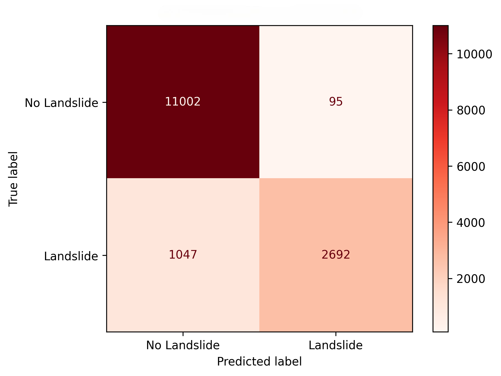
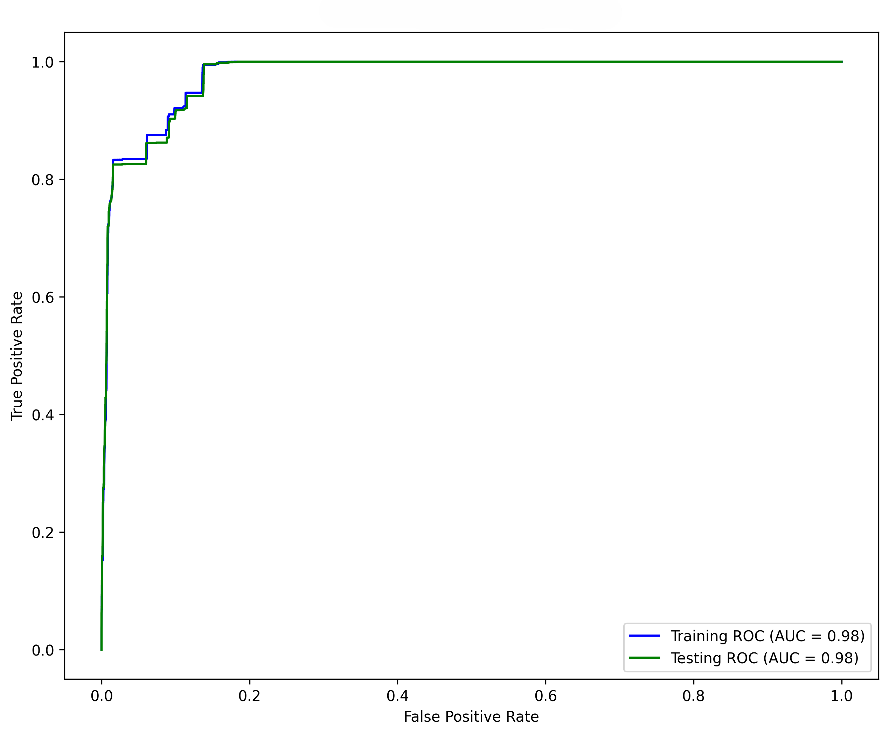
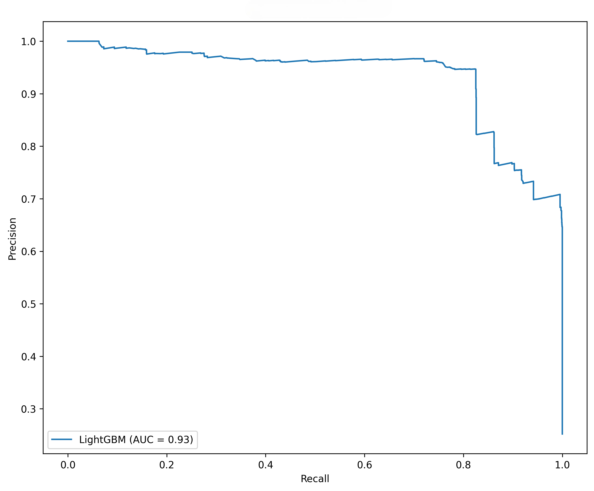
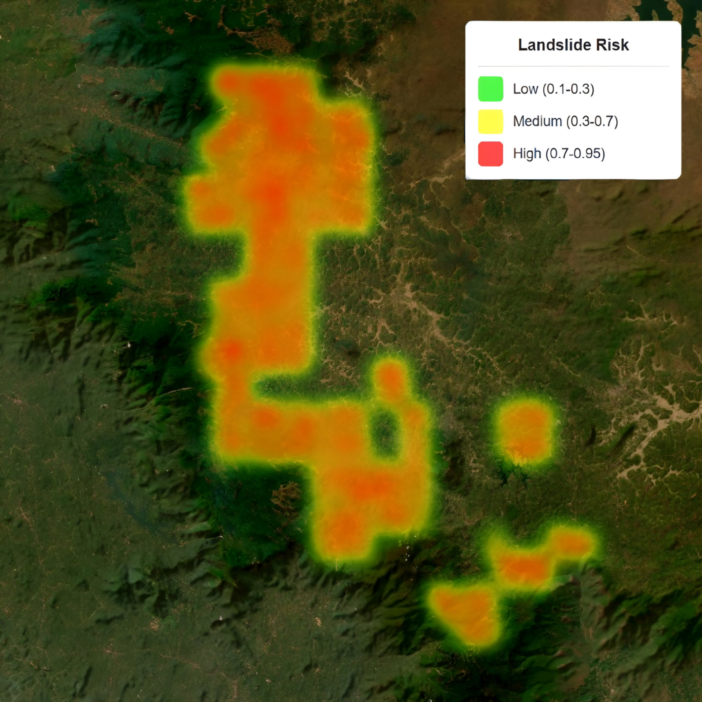

# Advanced-Sensor-Based-Landslide-Detection-and-Alert-System-Utlizing-Machine-Learning
 In this proposed system, we present a precise and timely warning system to reduce the effects of landslides. This system strategically partitions its ML and IoT components, improving both risk prediction and simultaneous supervision. The predictive model LightGBM, is trained with an extensive dataset obtained from DEM, which enabled mapping out high-risk areas with great accuracy. The system utilizes IoT nodes dedicated entirely to areas of high risk pinpointed by the ML model, consisting of a rain sensor, a soil moisture sensor, an ADXL 345 sensor, and a GPS module that sends real-time updates to a centralized cloud framework. All real-time sensed data are processed and demonstrated on an android dashboard and features an interactive map that shows hazard zones, allowing swift action and emergency response. It has been programmed to trigger an alert when abnormalities are detected. The combination of machine learning and the IoT allows for increased accuracy of prediction and responsiveness, making it a strong and scalable solution to protect people in regions prone to landslides. The proposed system significantlyimproves the efficiency of technology in disaster management.

## 🛠️ How to Run the Project

### 🔍 Machine Learning Part

1. **Install dependencies**
   ```bash
   pip install -r requirements.txt
   ```

2. **Run the Jupyter notebooks**
   - Open `LightGBM.ipynb` to train the landslide detection model.
   - Use `Model_Comparison.ipynb` to compare different ML models.

3. **Required files**
   - Make sure all dataset files are in the appropriate `data/` folder.

### 🌐 IoT Part

1. **Hardware Setup**
   - ESP32 microcontroller
   - Sensors:
     - Soil Moisture Sensor (Analog)
     - Rainfall Sensor
     - ADXL345 Accelerometer (I2C)
     - NEO-6M GPS Module
   - Connect as per the provided circuit diagram.

2. **Software Setup**
   - Use the Arduino IDE.
   - Install the following libraries:
     - `Firebase_ESP_Client`
     - `TinyGPS++`
     - `Adafruit_Sensor`
     - `Adafruit_ADXL345_U`
   - Upload the `IoT code.txt` to your ESP32.

3. **Connectivity**
   - Set Wi-Fi credentials and Firebase configuration in the code.

---

## 📊 Results

### ✅ Evaluation Metrics

| Model                   | Accuracy | ROC-AUC   | Recall  | F1-Score |  Specificity |
|-------------------------|----------|-----------|---------|----------|--------------|
| LightGBM                | 83.99%   | 91.55%    | 84.63%  | 84.63%   | 84.63%       |
| RandomForest            | 84.63%   | 84.63%    | 84.63%  | 84.63%   | 84.63%       |
| SVM                     | 84.63%   | 84.63%    | 84.63%  | 84.63%   | 84.63%       |
| Gradient Boosting       | 84.63%   | 84.63%    | 84.63%  | 84.63%   | 84.63%       |
| MultiLayer Perceptron   | 84.63%   | 84.63%    | 84.63%  | 84.63%   | 84.63%       |
| CNN                     | 84.63%   | 84.63%    | 84.63%  | 84.63%   | 84.63%       |
| Logistic Classifier     | 84.63%   | 84.63%    | 84.63%  | 84.63%   | 84.63%       |
| AdaBoost                | 84.63%   | 84.63%    | 84.63%  | 84.63%   | 84.63%       |
| NaiveBayes Classifier   | 84.63%   | 84.63%    | 84.63%  | 84.63%   | 84.63%       |


### 📈 Plot Explanations

<ul>
  <li>
    <strong>SHAP Analysis</strong>: Shows feature contribution for better explainability.<br/>
    
  </li>
  <li>
    <strong>Confusion Matrix</strong>: Highlights class prediction distribution.<br/>
    
  </li>
  <li>
    <strong>ROC Curve</strong>: Compares true positive rate vs. false positive rate.<br/>
    
  </li>
  <li>
    <strong>Precision-Recall Curve</strong>: Compares precision vs. recall rate.<br/>
    
  </li>
</ul>


---

## ⚠️ Model Comparison

Various models were tested including:
- LightGBM (best-performing)
- Random Forest
- Support Vector Machines
- Logistic Regression

LightGBM outperformed other models in terms of both accuracy and generalization.

---

## 🔥 Heatmap and Hazard Point Generation

- Landslide risk zones are visualized on a **heatmap** using GPS-coordinates.
- Risk levels:
  - 🟢 Low
  - 🟡 Moderate
  - 🔴 High



---

## 🔧 IoT System Details

### 🖼️ Circuit Diagram and Setup

<p align="center">
  
  
</p>


1. ESP32 Microcontroller  
2. Raindrop Sensor  
3. Soil Moisture Sensor 
4. 3-axis ADXL 345 Accelerometer Sensor 
5. Neo 6M GPS Module 

### 📏 Equations and Logic Used

1. **Moisture + Rainfall Risk Index**

   - `RiskIndex = (0.6 × Moisture%) + (0.4 × Rain%)`  
   > Alert if RiskIndex > 58%

3. **Rainfall + Vibration Multiplicative Risk**

   - `RiskMulti = (Rain% / 40) × (Vibration / 20)`  
   > Alert if RiskMulti > 0.35

4. **Triple Alert Criteria**

   - `Moisture% >= 50 AND Rain% >= 20 AND Vibration >= 12`

5. **Risk Level Calculation**

   - `Overall Risk (%) = 0.4 × MoistureRisk + 0.4 × RainRisk + 0.2 × VibrationRisk`

7. **Categorization**
   - `0–25`: LOW
   - `25–50`: MODERATE
   - `50–75`: HIGH
   - `75–100`: EXTREME

### ☁️ Firebase Integration

- Realtime sensor updates under `/sensor_readings`
- Alerts pushed to `/alerts` node with cooldown mechanism

---

## 📌 Project Highlights

- 🔁 Real-time sensor data + prediction-based alert system
- 📍 GPS-linked location tagging for hazardous zones
- 📉 Machine learning improves prediction beyond threshold-only logic
- 🛰️ Combines physical sensing with cloud-based data logging

---

## 📬 Contact

For any queries, reach out at [your-email@example.com].
